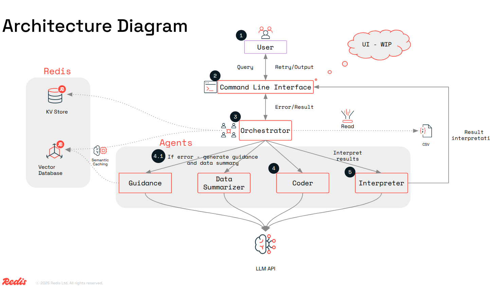

# Learning Agent - Intelligent Data Analysis System

A sophisticated multi-agent system for intelligent data analysis and processing of pandas dataframes using natural language queries.

## 🏗️ Architecture Overview



## 🎯 System Components

-   **PandasPlannerAgent**: The core orchestrator that manages the data analysis workflow, coordinates specialized agents, and handles caching.
-   **ColumnSummaryAgentWrapper**: Analyzes the dataframe's structure and generates meaningful summaries for each column.
-   **FilterAgentWrapper**: Converts natural language queries into executable pandas code, manages an interactive feedback loop, and tracks performance metrics.
-   **RawDataReaderProcessor**: Handles data loading from CSV and JSON files.
-   **Redis Cache Layer**: Provides persistent, method-level caching to speed up repeated operations.
-   **Guidance System**: Learns from past successes and failures to provide contextual guidance, improving accuracy and reducing errors over time. It persists this memory in `guidance.json`.

## 🛠️ Technology Stack

-   **AI Models**: OpenAI GPT-4o-mini, Google Gemini
-   **Data Processing**: Pandas, NumPy
-   **Caching**: Redis
-   **Agent Framework**: Agno
-   **CLI**: Rich
-   **Packaging**: UV
-   **Configuration**: YAML
-   **Data Models**: Pydantic

## 🚀 Getting Started

### Prerequisites
-   Python 3.11+
-   `uv` installed (`pip install uv`)
-   Redis server running
-   OpenAI API key set as an environment variable (`OPENAI_API_KEY`)

### Installation

1.  **Clone the repository:**
    ```bash
    git clone https://github.com/redis/redis-ai-research-public.git
    cd redis-ai-research-public/learning-agents
    ```

2.  **Install dependencies using uv:**
    This command creates a virtual environment and installs all dependencies from `pyproject.toml` and `uv.lock`.
    ```bash
    uv sync
    ```

### Configuration

1.  Edit the configuration file at `config/config.yaml`.
2.  Set the `filename` to point to your data file (e.g., `data/bank-full.csv`).
3.  If using a CSV file, you can optionally specify a `delimiter`.

    ```yaml
    filename: data/bank-full.csv
    delimiter: ";"
    ```

### Usage

1.  **Activate the virtual environment:**
    ```bash
    source .venv/bin/activate
    ```

2.  **Run the agent:**
    ```bash
    uv run analyze-csv
    ```
    This will start the interactive agent using the default configuration (`config/config.yaml`).

3.  **To use a different configuration file:**
    ```bash
    uv run analyze-csv --config path/to/your/config.yaml
    ```
4. **To see all options**
   ```bash
   uv run analyze-csv --help
   ```

### Example Queries

Once the agent is running, you can ask questions like:
-   "What is the average value of column X?"
-   "Show me the distribution of values in column Y"
-   "Filter data where column Z > 100"
-   "Give me a breakdown of the percentage of married people by age groups"
-   "Which education degree is least likely to default?"
-   "Plot the distribution of balance by job category"

## 🧠 Advanced Topics

-   **Performance Monitoring**: The system tracks token usage, execution time, and success rates, printing metrics after each operation.
-   **Learning & Memory**: The guidance system learns from your interactions. Errors and successful queries are used to build a knowledge base (`guidance.json`) that helps the agent perform better on future tasks.
-   **Contributing**: The system is modular. To extend it, create a new agent inheriting from `AgentWrapper`, implement its logic, and integrate it into the `PandasPlannerAgent`.

## 📝 License

This project is part of a learning agent system for intelligent data analysis.