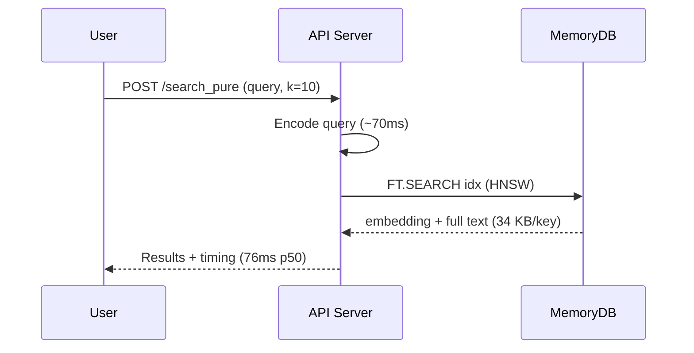
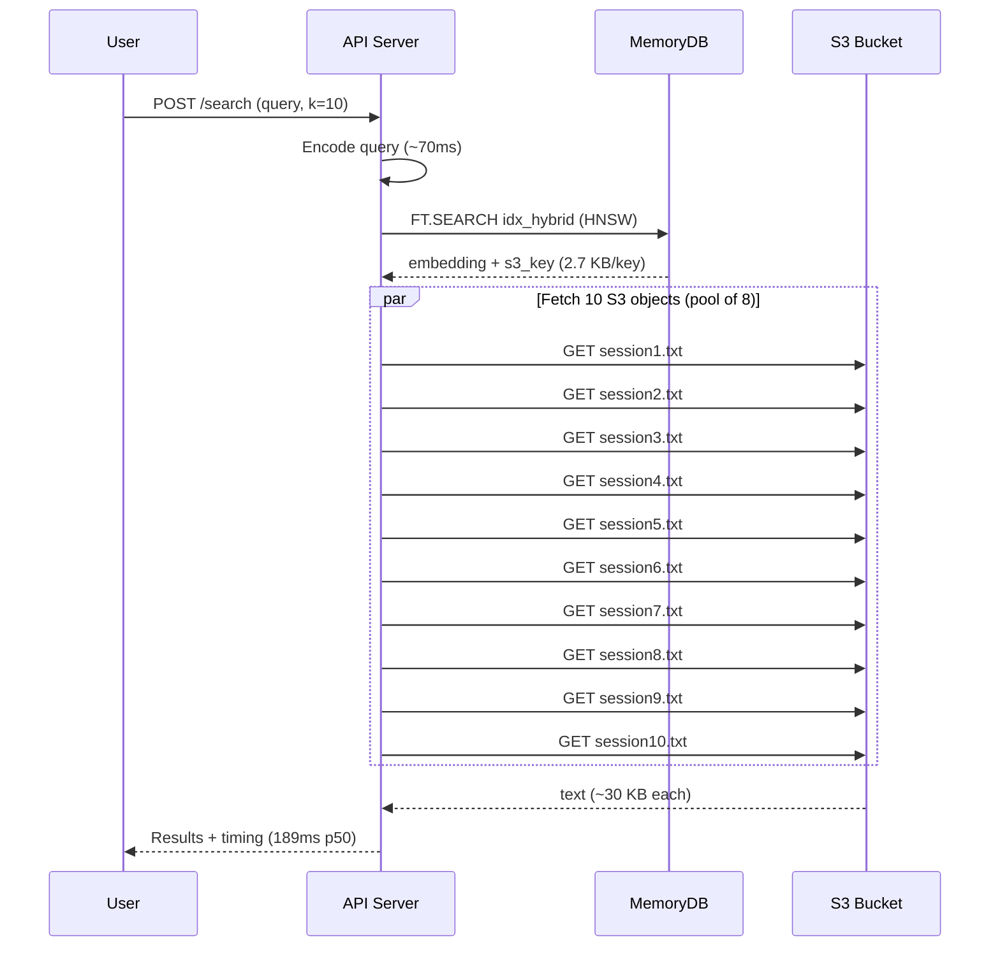
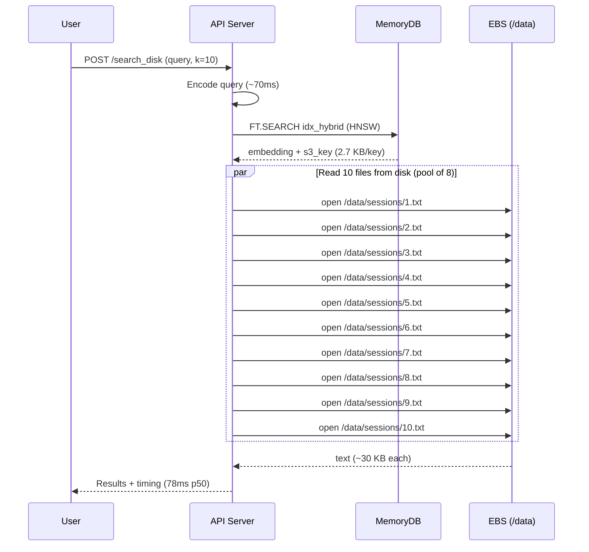

# Architecture

## Pure Redis

**Redis key:** `{session}:{question_id}:{session_index}` → `{embedding, text, ...}`

---

## Hybrid Redis + S3

**Redis key:** `{hybrid}:{question_id}:{session_index}` → `{embedding, s3_key, ...}`
**S3 key:** `sessions/{question_id}/{session_index}.txt`

---

## Hybrid Redis + EBS Local Disk

**Same index as Hybrid+S3** (`idx_hybrid`), same key structure. Only the text fetch path differs.

---

## Comparison

| | Pure Redis | Hybrid S3 | Hybrid EBS |
|---|---|---|---|
| **Redis** | 7.78 GB, r7g.large ($245/mo) | 0.62 GB, r6g.large ($191/mo) | 0.62 GB, r6g.large ($191/mo) |
| **Extra storage** | none | ~7 GB S3 ($0.14/mo) | 10 GB gp3 ($1/mo) |
| **Latency p50** | 76ms | 189ms | 78ms |
| **Std dev** | 7.7ms | 209ms | 7.2ms |
| **Hops** | 1 (Redis) | 2 (Redis → S3) | 2 (Redis → local file) |
