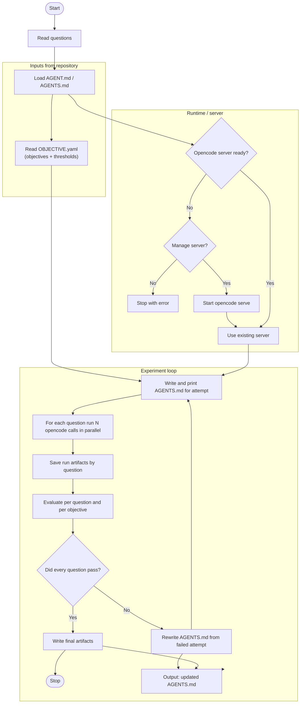

# OpenCode Spec Optimization

This workflow runs every question in `QUESTIONS.yaml`, executes each one multiple times in parallel, evaluates the results against `OBJECTIVE.yaml`, and iteratively rewrites `AGENTS.md` until the success threshold is met or the retry limit is reached.

## How It Works

1. Load repository instructions from `AGENT.md` or `AGENTS.md`.
2. Load `run_count` from `config.yaml` when present.
3. Read the objectives and thresholds from `OBJECTIVE.yaml`.
4. Ensure an OpenCode server is available, starting `opencode serve` when needed.
5. For each attempt, write the current instructions back to the live `AGENTS.md` and print them at the start of the iteration.
6. For each question in `QUESTIONS.yaml`, send the same question to OpenCode `run_count` times in parallel.
7. Evaluate each question against the per-objective thresholds, then mark the attempt successful only when every question passes.
8. If the attempt fails, rewrite `AGENTS.md` from the full previous attempt artifacts and try again.

## Flow



## Usage

Put your questions in `QUESTIONS.yaml` at the repo root, then run:

```bash
./.venv/bin/python main.py
```

To bootstrap the required files with example templates:

```bash
./.venv/bin/python main.py --setup
```

Optional model override:

```bash
./.venv/bin/python main.py --model gpt-5.4
```

The script no longer accepts a question on the command line; it always reads the full question set from `QUESTIONS.yaml`.
`--setup` creates `QUESTIONS.yaml`, `OBJECTIVE.yaml`, and `config.yaml` when they are missing, prints example templates for all three, and reminds you to fill in the questions and objectives before running the workflow.

## Environment

- `OPENCODE_BASE_URL` defaults to `http://localhost:4096`
- `OPENCODE_PROVIDER_ID` defaults to `opencode`
- `OPENCODE_MODEL_ID` uses the provider default when unset
- `OPENCODE_MCP_SERVER` overrides Redis MCP auto-discovery when needed

## Config File

Set the parallel run count in `config.yaml` at the repo root:

```yaml
run_count: 3
```

If `config.yaml` is missing, the workflow falls back to `3` runs.

## Questions File

`QUESTIONS.yaml` can be either:

```yaml
questions:
  - What slow queries do I have?
  - Which indexes are partial?
```

or a plain YAML list.

## Useful Flags

- `--setup` creates example `QUESTIONS.yaml`, `OBJECTIVE.yaml`, and `config.yaml` files, prints their templates, and exits
- `--server-start-timeout 45` waits longer for `opencode serve` to become ready
- `--no-manage-server` uses an already-running server and never starts or stops one
- `--model gpt-5.4` overrides the OpenCode model for all runs
- `--max-tries 5` increases the number of optimization attempts

## Output

Each run creates a timestamped artifact directory containing:

- `request.json` - the input questions and run settings
- `server.json` - the OpenCode runtime settings
- `attempts.json` - summary of each optimization attempt
- `original-AGENTS.md` - the starting instruction file before optimization
- `attempt-*/AGENTS.md` - the instruction file used for that attempt
- `attempt-*/OBJECTIVE.yaml` - the copied objective config for that attempt
- `attempt-*/request.json` - the attempt-level input settings
- `attempt-*/question-*/run-*.json` - saved response payloads
- `attempt-*/question-*/run-*.md` - rendered response text and tool activity
- `attempt-*/question-*/evaluation.json` - pass/fail results for the question
- `attempt-*/question-*/request.json` - the per-question input settings
- `attempt-*/evaluation.json` - pass/fail results for the attempt across all questions
- `final-AGENTS.md` - the last instruction file used
- `final-evaluation.json` - the final evaluation summary

## Objective File

`OBJECTIVE.yaml` defines each objective explicitly. Each objective threshold is measured across the runs for a single question. A question passes only when all objective thresholds are satisfied:

```yaml
objectives:
  - id: use_redis_for_question
    description: The agent must know to access the redis database for the user question
    threshold: 100%
  - id: read_diagnostics_first
    description: The diagnostics/diagnose_issues.json must be read first
    threshold: 100%
```
